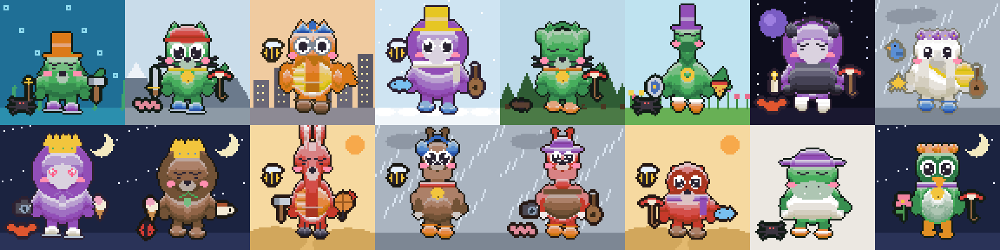
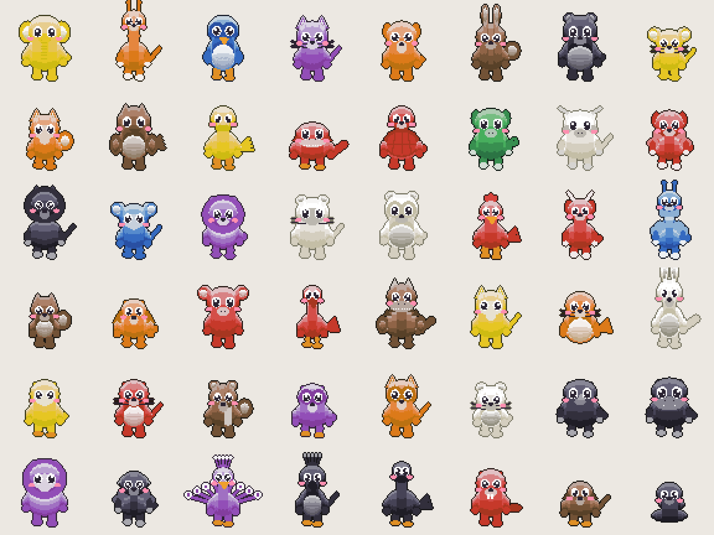

# Wordpet

Deterministic pixel pets from words. The same string always draws the same creature, on every
machine, in every browser, forever.

Five versions ship side by side. None replaces the one before it.

| | v1 | v2 | v3 | v4 | v5 |
| --- | --- | --- | --- | --- | --- |
| Demo | [/](https://eminogrande.github.io/wordpet/) | [/v2](https://eminogrande.github.io/wordpet/v2/) | [/v3](https://eminogrande.github.io/wordpet/v3/) | [/v4](https://eminogrande.github.io/wordpet/v4/) | **[/v5](https://eminogrande.github.io/wordpet/v5/)** |
| Module | `pixelpet.js` | `wordpet2.js` | `wordpet3.js` | `wordpet4.js` | `wordpet5.js` |
| Frame | 32² | 48² | 48² | 64² + scene | 72² + scene |
| Animals | generic | 32 | 32 | 32 | **48** |
| Identities | 4.5e11 | 5.6e8 | 4.7e7 | 2.3e12 | **1.47e14** |
| With code or seal | n/a | 2.47e15 | 1.31e14 | 5.18e18 | **2.48e20** |
| Good for | avatars | English | any language | any language | **the one to use** |




```js
const t = Wordpet5.traitsFor('emino');
t.petName      // 'Green Seal'
t.shortPhrase  // 'Green Seal in the orange helmet, in space'
t.emojiLine    // '🟢🦎 🟠🎩 🚫 🥱 🟣⛸️ 🔨✨ 🕷️ 🌊'
t.phrase       // 'the green lizard, orange top hat, wearing nothing, sleepy eyes,
               //  purple ice skates, holding a hammer and a wand, with a spider, underwater'
Wordpet5.renderFull(t, 0, false);   // 5184 hex colours or nulls, scene included
Wordpet5.parseEmoji(t.emojiLine);   // the traits, read back out of the emoji alone
```

## Which one to use

**v5.** Same rule as v3 and v4, a much larger vocabulary, and its own renderer with a softer, cuter
look. v4 is the same idea in the older flat style, v3 is half the size, v2 trades language
independence for a bigger space, v1 is decoration.

## Why v2 exists

v1 makes a picture. Comparing pictures is a private act: you cannot say a picture down a phone
line, and a person glancing at one registers maybe nine bits of it, which is 221 ground addresses
away from a convincing forgery.

v2 turns the identity into a sentence. The hash picks words from fixed vocabularies in a fixed
slot order, and the renderer draws that sentence. The description is therefore canonical rather
than subjective, so two people always describe one pet with the same words, and verification
becomes something two humans can do out loud.

The emoji code is deliberately **not** a description of the pet. It reads digest bits the phrase
never touches, so matching the phrase does not hand an attacker the code, and the two costs
multiply instead of overlapping.

## Why v3 exists

v2's emoji code deliberately described nothing. That bought the most security per emoji, and it
cost comprehension: the code was a second thing to check rather than a second way to read the
first thing.

v3 takes the opposite trade. Five slots, five emoji groups, five parts of the drawing, and the
emoji line is a literal transcription of the sentence:

```
Green Seal
🟢🦭  🟠🪖  👀  🚫  🍦
the green seal, orange helmet, big eyes, bare feet, holding an ice cream
seal 🔬🎾🧭
```

`🟢🦭` is "green seal". `🟠🪖` is "orange helmet". `🚫` in the shoe slot is "bare feet". Someone who
reads no English can still check every slot.

This is not a claim, it is a round trip. `parsePhrase` rebuilds the traits from the sentence alone
and `parseEmoji` rebuilds them from the emoji alone, and `test3.js` checks both against the
original on 150,000 pets. If a word, an emoji or a drawn part ever drifted, the test fails.

**What the rule costs.** The vocabulary shrinks to what can be drawn **and** named **and** given an
unmistakable emoji, which is the tightest of the three constraints:

- Colours drop from 12 to 9. Turquoise, pink and grey have no emoji circle every vendor draws the same.
- Coat patterns are gone entirely. No emoji reliably means "striped".
- Hats drop from 16 to 8. Beanie, halo, headband and chef hat have no object emoji.
- The movement trait is gone. Every v3 pet has one idle bob, because a moving pet that no word
  names would break the rule.

Result: 46,559,232 identities against v2's 559 million. That is the price of the correspondence,
and it is why the seal exists.

**The seal** is three emoji drawn from a pool of 142 that name no trait, read from digest fields
the sentence never touches. It is presented separately in the UI because it is a different kind of
thing. Identity and seal together are 46.9 bits.

## Why v5 exists

v4 was correct and a bit stiff. v5 forks the renderer, which v2, v3 and v4 could not do without
changing their own output, and spends the freedom on how the pets look:

- **One soft blob.** The head is nearly as wide as the body and overlaps it heavily. No neck unless
  the animal has one.
- **Volume, not flat fill.** Every material carries five tones. A pass walks each vertical run of a
  surface and ramps it from a rim light at the top down to a shadow, then darkens the trailing edge
  of each row because the light sits upper-left.
- **Big eyes.** Optional dark mask, white sclera, wide pupil, a two-pixel highlight and a small
  counter-highlight. Blush unless the species wears a mask.
- **Tiny limbs.** Small feet and short arms against a large body is what reads as young.

The vocabulary grew with it: 48 animals, 10 hats, 10 things to wear, 10 kinds of footwear, 23 things
to hold in two hands, 12 companions, 12 places. That is 147,294,353,344,320 identities, 47.1 bits,
and 67.8 bits with the seal. A full forgery is 24 years on one core and 21 hours on hardware ten
thousand times faster.

v5 depends on v2 only for `sha256` and `normalize`, which are pure. Its renderer shares no code with
the earlier versions, and a test asserts it never reaches for v3 or v4.

## Why v4 exists

v3 proved the three-way rule works and showed what it cost: five slots is 46 million identities,
which one core forges in two and a half minutes. The fix was never to loosen the rule. It was that
five slots is too few.

v4 keeps the rule and adds four slots that satisfy all three constraints:

| Slot | Options | Why this one |
| --- | --- | --- |
| Scene | 8 places | the only trait that still reads at 24 pixels, because it is a large colour field |
| Worn | 6 things x 9 colours | the space between hat and shoes was empty, and it is the richest single slot |
| Both hands | 241 pairs | the second hand already existed and was simply empty |
| Companion | 8 creatures | a second silhouette in the frame, and the pets stopped looking lonely |

```
Green Seal in the orange helmet, in space
🟢🦭  🟠🪖  🟡🧣  👁️  🚫  ☔🔑  🐦  🌌
the green seal, orange helmet, yellow scarf, open eyes, bare feet,
holding an umbrella and a key, with a bird, in space
seal 🏀❄💎
```

That is 2,305,071,267,840 identities, 41.1 bits, against v3's 25.5. Measured on one core at 231,125
candidates per second: 115 days to forge a full match instead of 2.5 minutes, and 16 minutes rather
than instant on hardware ten thousand times faster. With the seal it is 62.2 bits, which is 71 years
even at that rate.

Because the sentence is now long, `traitsFor` also returns `shortPhrase`: the name plus the hat plus
the place. That is what people say day to day; the full sentence is for the moment that matters.

Two rendering changes came with it. Hats and shoes get an outline against the coat, so they stop
blending into it, and the held items are drawn by v4 rather than v2 so they can sit beside the pet
instead of on top of it.

## The v2 phrase

Nine slots, fixed order, every one visible in the still image and nameable by a child.

| Slot | Options | Example |
| --- | --- | --- |
| Coat pattern | plain, spotted, striped, patched | spotted |
| Body colour | 12 unambiguous names | blue |
| Species | 32 | elephant |
| Headwear | 16 including no hat | top hat |
| Headwear colour | 8 | white |
| Eyes | 8 | closed eyes |
| Shoes | 4 including bare feet | boots |
| Shoe colour | 8 | black |
| Held item | 16 including nothing | sword |

The pet's short name is the first two slots, so everyone is "the Blue Elephant" in casual use and
the full sentence is the long form when it matters.

Species is a preset that owns the silhouette: snout, ears, neck length, back, tail, limb type and
body proportion. The 32 are chosen to be distinct by shape **and** by sound. No crocodile beside
alligator, no crow beside raven, no dog beside frog.

Two consistency rules are enforced by the tests, because a sentence that disagrees with the
picture teaches people to ignore the picture:

- A species with no drawn feet is never described as wearing shoes.
- The article before a held item matches the word: an umbrella, a sword.

## Determinism

All five use only integer arithmetic, `Math.imul`, `Math.round`, `Math.abs` and division by
powers of two in the drawing path. There is deliberately no `Math.sin`, `Math.cos`, `Math.sqrt` or
`**`, because those are not required to be bit-identical across JavaScript engines, and one
unit-in-the-last-place of difference flips a pixel after rounding. The one curved tail in v1 is
stored as a literal pixel table for exactly that reason. The tests enforce this.

Nothing reads the clock, the locale, the platform or a random source. v2's SHA-256 is checked
against Node's `crypto` on every block boundary and on non-ASCII input.

**Normalisation differs between versions, on purpose.**

- v1 folds to `[a-z0-9-]`, so `eminö` and `emino` are one pet. Fine for a friendly avatar.
- v2 onward fold case and punctuation only and keep letters as they are, so `eminö`, `emino` and
  `eminо` with a Cyrillic o are three different people with three different pets. For a lookalike
  check, collapsing them would hide exactly the attack you are looking for.

## Threat model

Measured, not estimated. Reproduce with `node test.js` through `node test5.js`, and `node grind.js`.

### Accidental collisions

| Users | v1 | v2 | v3 | v4 | v5 |
| --- | --- | --- | --- | --- | --- |
| 10,000 | 0.00% | 0.00% | 0.02% | 0.00% | 0.00% |
| 100,000 | 0.00% | 0.02% | 0.21% | 0.00% | 0.00% |
| 1,000,000 | 0.00% | 0.18% | 2.12% | 0.00% | 0.00% |
| 10,000,000 | 0.00% | 1.77% | 19.33% | 0.00% | 0.00% |

v3's column is the honest cost of five slots: at ten million users, one in five would share an
identity with somebody. v4 fixes that. One million sampled usernames gave 999,970 distinct v4
identities.

v1 has the larger raw space, because 360 free hues buy combinations cheaply. v2 trades that away
for nameability, which is the right trade: a hue nobody can say is worth nothing in a verbal check.

One million sampled usernames in v2 produced 995,963 distinct phrases and 1,000,000 distinct
phrase-plus-emoji pairs.

Global uniqueness is also the wrong target. You never compare yourself against ten million
strangers, only against your own address book. For a user with 100 saved contacts, the chance any
two of them collide is around two in a million. The claim to make in the product is "no two people
you deal with will have the same pet", which is true, and not "your pet is unique in the world",
which is not.

### Deliberate collisions

An attacker does not need your exact pet. They need one you will not question. Measured on one
laptop core at 343,643 candidates per second, and again at 10,000 times that rate for a serious
GPU grinder:

| Identity being forged | States | One core | 10,000x |
| --- | --- | --- | --- |
| v1, at a glance: colour, hat, shape | 480 | instant | instant |
| v1, a careful look | 737,280 | 2.5 s | instant |
| v2, colour and species and hat only | 6,144 | instant | instant |
| v2, the whole phrase | 559,054,848 | 27 min | 0.2 s |
| v3, the full three-way identity | 46,559,232 | 2.5 min | instant |
| v4, colour and species and scene | 2,304 | instant | instant |
| v4, the full three-way identity | 2.31e12 | 115 days | 16.6 min |
| v5, the full three-way identity | 1.47e14 | 24 years | 21 h |
| **v3, identity and seal** | **1.31e14** | **13.4 years** | **11.7 h** |
| **v2, phrase and emoji code together** | **2.47e15** | **227 years** | **8.3 days** |
| **v4, identity and seal** | **5.18e18** | **7.1e5 years** | **71 years** |
| **v5, identity and seal** | **2.48e20** | **4.0e7 years** | **4,000 years** |

That last row is the only one in this table that is safe to gate a payment on, and only if the
person actually reads both the sentence and the code. A glance is worth nothing no matter which
version renders it.

**Use it as a reject signal.** A wrong pet means stop. A right pet is not proof, and for anything
irreversible the address still has to be checked in full.

## API

No dependencies, no build step, browser and Node.

```html
<script src="wordpet2.js"></script>   <!-- window.Wordpet2 -->
```
```js
const Wordpet2 = require('./wordpet2.js');
```

| Call | Returns |
| --- | --- |
| `traitsFor(name)` | traits, `phrase`, `segments`, `petName`, `emoji`, `fingerprint`, `col`, `words` |
| `render(traits, phase, blink)` | flat array of hex strings or `null`, `W * H` long |
| `motion(traits, f)` | `{dx, dy, sx, sy, rot}` for animation frame `f` in `0..1` |
| `segmentsOf(traits)` | `[{text, trait, slot}]`, the sentence split into slots for highlighting |
| `emojiGroupsOf(traits)` | v3 and v4: `[{slot, emoji, says}]`, one group per sentence slot |
| `parsePhrase(str)` / `parseEmoji(line)` | v3 and v4: read the traits back out of either view |
| `renderScene(traits)` / `renderFull(...)` | v4 only: the background layer, and both layers merged |
| `normalize(name)` | the canonical string that gets hashed |
| `sha256(str)` | the raw 32-byte digest |

v1 exposes the same shape as `window.PixelPet` minus the phrase parts. `phase` is `0..3` and drives
limbs, tail and hat wobble; ignore it and `blink` for a still avatar.

Build the sentence UI from `segments`, not by matching words against the rendered phrase. Both come
from one list, so they cannot drift apart.

## Files

| File | Purpose |
| --- | --- |
| `pixelpet.js` | v1 algorithm |
| `wordpet2.js` | v2 algorithm and the shared renderer |
| `wordpet3.js` | v3 vocabulary, emoji transcription and parsers; needs `wordpet2.js` |
| `wordpet4.js` | v4 scenes, worn items, both hands, companions; needs `wordpet2.js` and `wordpet3.js` |
| `wordpet5.js` | v5 renderer, style and vocabulary; needs `wordpet2.js` for the hash only |
| `page*.html` | UI templates, each with inlining markers |
| `build.js` | writes `artifact*.html` and `docs/**/index.html` |
| `test.js` … `test5.js` | determinism, agreement, round trips, collision maths |
| `grind.js` | v1 deliberate-forgery cost |
| `preview*.js` | contact sheets |

```
node test.js && node test2.js && node test3.js && node test4.js && node test5.js
node grind.js                                   # v1 forgery cost
node preview.js && node preview2.js && node preview3.js && node preview4.js
node preview5.js && node preview5.js preview5-species.png species
node build.js                                   # rebuild all five pages
```

## Licence

MIT
