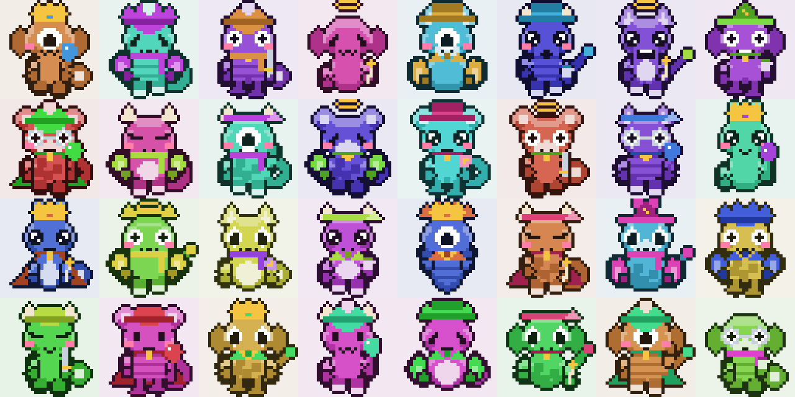

# Wordpet

Deterministic pixel pets from words. The same string always draws the same 32x32 animated
creature, on every machine, in every browser, forever.

**[Try it →](https://eminogrande.github.io/wordpet/)**



```js
const t = PixelPet.traitsFor('green-elephant-hat');
const pixels = PixelPet.render(t, 0, false);   // 1024 hex colours or nulls
t.fingerprint                                  // '…' 128-bit hex, same everywhere
```

## What it is for

An identicon you can recognise and describe out loud. "Mine is the green frog in the top hat"
is a thing a person can hold in their head; `0x758A…eE6A` is not. Use it to make an account,
a username or an address *recognisable*.

## What it is not for

**Do not use the pet alone to authorise a payment.** Read the threat model below first. It is
a fast way to notice that something is wrong, not proof that something is right.

## Install

No dependencies, no build step, works in a browser and in Node.

```html
<script src="pixelpet.js"></script>
```
```js
const PixelPet = require('./pixelpet.js');
```

## API

| Call | Returns |
| --- | --- |
| `PixelPet.traitsFor(words)` | trait object: `fingerprint`, `hue`, `col`, `label`, and one index per dimension |
| `PixelPet.render(traits, phase, blink)` | flat array of 1024 (`32 x 32`) hex strings or `null` for transparent |
| `PixelPet.motion(traits, f)` | `{dx, dy, sx, sy, rot}` for animation frame `f` in `0..1` |
| `PixelPet.normalize(words)` | the canonical string that gets hashed |

`phase` is `0..3` and drives limbs, tail and hat wobble. `blink` swaps the eyes shut.
Ignore both for a still avatar.

## How the determinism works

1. Input is lowercased, `NFKD`-folded, and reduced to letters, digits and single dashes.
   `Blue Panda`, `blue--panda` and `BLUE_PANDA` are one pet.
2. That string goes through four FNV-1a passes with different seeds, giving a 128-bit
   fingerprint.
3. The fingerprint seeds an sfc32 generator. Every trait is drawn from that stream in fixed
   order.

The drawing path uses only integer arithmetic, `Math.imul`, `Math.round`, `Math.abs` and
division by powers of two. There is deliberately **no** `Math.sin`, `Math.cos` or `Math.sqrt`
in it, because those are not bit-identical across JavaScript engines. The one curved tail is
stored as a literal pixel table for exactly that reason. `test.js` enforces this.

Nothing reads the clock, the locale, the platform or a random source.

## Traits

Fourteen dimensions feed the still image, plus one that only affects movement.

| Dimension | Count | Values |
| --- | --- | --- |
| Hue | 360 | full circle |
| Accent shift | 7 | complement, triad, split, analogous |
| Body | 5 | round, egg, pear, chunky, slim |
| Ears | 8 | plain, cat, bunny, horns, antennae, mouse, spikes, floppy |
| Eyes | 8 | beads, big, sleepy, wide, sharp, sparkle, goggles, cyclops |
| Mouth | 6 | smile, grin, oh, beak, whiskers, tongue |
| Hat | 8 | bare, cap, top hat, beanie, crown, wizard, headband, halo |
| Arms + item | 9 reachable | 4 poses x 6 items, minus impossible pairs |
| Legs | 4 | stubby, long, none, paws |
| Worn | 5 | bare, scarf, collar, cape, bow tie |
| Coat | 4 | plain, belly patch, spots, stripes |
| Tail | 4 | none, curl, puff, long |
| Muzzle | 2 | on, off |
| Blush | 2 | on, off |
| Movement | 6 | bob, hop, sway, float, wiggle, march *(animation only)* |

Two coupling rules keep compositions readable: a raised arm drops when the pet is carrying
something, and wings never hold items.

## Threat model

Measured, not estimated. Run `node test.js` and `node grind.js` to reproduce.

### Accidental collisions

Two people picking unrelated words almost never land on the same pet.

| Users | Share who match somebody exactly | Share who match at 24 tellable hues |
| --- | --- | --- |
| 10,000 | 0.00% | 0.00% |
| 1,000,000 | 0.00% | 0.00% |
| 10,000,000 | 0.00% | 0.03% |

Two million sampled strings produced two million distinct fingerprints and 1,999,992 distinct
looks. Collisions are unavoidable in principle, because there are infinitely many strings and
445,906,944,000 possible pets. In practice, at your scale, they do not happen by chance.

### Deliberate collisions

This is the number that matters, and it is not reassuring. An attacker does not need your
exact pet. They need a pet that *you* will not question. Average addresses ground per
successful forgery, single core, on a laptop:

| How closely the human looks | States they tell apart | Addresses ground | Time |
| --- | --- | --- | --- |
| Half a glance: colour, hat, shape | 480 | 221 | instant |
| A proper look: adds ears, eyes, mouth, legs | 737,280 | 845,677 | ~2.5 seconds |
| Pixel-perfect comparison | 445,906,944,000 | not found in 40,000,000 | > 2 minutes each, gave up |

A vanity-address grinder on a GPU does millions of candidates per second. Forging a pet that
survives a careful human comparison is minutes of work. Forging one that survives a glance is
free.

**What that means.** The pet is excellent against typos, truncated-address checks, and
clipboard-swapping malware that substitutes an address it did not choose. It is weak against
a targeted attacker who grinds addresses to match yours. Treat it as a fast reject signal,
never as a confirm signal, and never as the only check on a payment.

## Files

| File | Purpose |
| --- | --- |
| `pixelpet.js` | the algorithm, browser and Node |
| `page.html` | UI template, holds a `<!--PIXELPET-->` marker |
| `build.js` | inlines the algorithm into `artifact.html` and `docs/index.html` |
| `test.js` | determinism, normalisation, no-hidden-state, collision maths |
| `grind.js` | deliberate-forgery cost measurement |
| `preview.js` | renders the contact sheet above |

```
node test.js      # correctness and determinism
node grind.js     # forgery cost
node preview.js   # regenerate preview.png
node build.js     # rebuild the pages
```

## Licence

MIT
