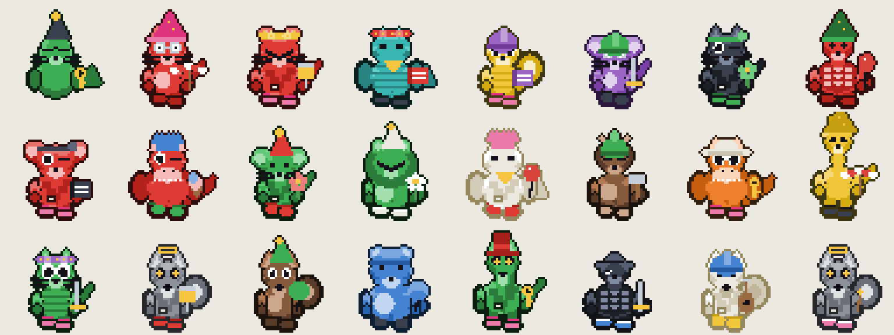

# Wordpet

Deterministic pixel pets from words. The same string always draws the same creature, on every
machine, in every browser, forever.

Two versions ship side by side. They are separate algorithms and neither replaces the other.

| | v1 | v2 |
| --- | --- | --- |
| Demo | **[eminogrande.github.io/wordpet](https://eminogrande.github.io/wordpet/)** | **[/v2](https://eminogrande.github.io/wordpet/v2/)** |
| Module | `pixelpet.js` | `wordpet2.js` |
| Hash | FNV-1a x4, 128 bit | SHA-256, digest sliced into 16 independent fields |
| Grid | 32 x 32 | 48 x 48 |
| Creature | generic, parametric | 32 named species |
| Output | a picture | a picture, a sentence, and a three-emoji code |
| Good for | avatars, recognition | verifying who you are about to pay |



```js
const t = Wordpet2.traitsFor('emino');
t.petName    // 'Green Seal'
t.phrase     // 'the green seal, black party hat, closed eyes, bare feet, holding a key'
t.emoji      // ['🐊','🔭','🦎']
t.fingerprint// full SHA-256 hex
Wordpet2.render(t, 0, false);   // 2304 hex colours or nulls
```

## Why v2 exists

v1 makes a picture. Comparing pictures is a private act: you cannot say a picture down a phone
line, and a person glancing at one registers maybe nine bits of it, which is 221 ground addresses
away from a convincing forgery.

v2 turns the identity into a sentence. The hash picks words from fixed vocabularies in a fixed
slot order, and the renderer draws that sentence. The description is therefore canonical rather
than subjective, so two people always describe one pet with the same words, and verification
becomes something two humans can do out loud.

The emoji code is deliberately **not** a description of the pet. It reads digest bits the phrase
never touches, so matching the phrase does not hand an attacker the code, and the two costs
multiply instead of overlapping.

## The v2 phrase

Nine slots, fixed order, every one visible in the still image and nameable by a child.

| Slot | Options | Example |
| --- | --- | --- |
| Coat pattern | plain, spotted, striped, patched | spotted |
| Body colour | 12 unambiguous names | blue |
| Species | 32 | elephant |
| Headwear | 16 including no hat | top hat |
| Headwear colour | 8 | white |
| Eyes | 8 | closed eyes |
| Shoes | 4 including bare feet | boots |
| Shoe colour | 8 | black |
| Held item | 16 including nothing | sword |

The pet's short name is the first two slots, so everyone is "the Blue Elephant" in casual use and
the full sentence is the long form when it matters.

Species is a preset that owns the silhouette: snout, ears, neck length, back, tail, limb type and
body proportion. The 32 are chosen to be distinct by shape **and** by sound. No crocodile beside
alligator, no crow beside raven, no dog beside frog.

Two consistency rules are enforced by the tests, because a sentence that disagrees with the
picture teaches people to ignore the picture:

- A species with no drawn feet is never described as wearing shoes.
- The article before a held item matches the word: an umbrella, a sword.

## Determinism

Both versions use only integer arithmetic, `Math.imul`, `Math.round`, `Math.abs` and division by
powers of two in the drawing path. There is deliberately no `Math.sin`, `Math.cos`, `Math.sqrt` or
`**`, because those are not required to be bit-identical across JavaScript engines, and one
unit-in-the-last-place of difference flips a pixel after rounding. The one curved tail in v1 is
stored as a literal pixel table for exactly that reason. The tests enforce this.

Nothing reads the clock, the locale, the platform or a random source. v2's SHA-256 is checked
against Node's `crypto` on every block boundary and on non-ASCII input.

**Normalisation differs between versions, on purpose.**

- v1 folds to `[a-z0-9-]`, so `eminö` and `emino` are one pet. Fine for a friendly avatar.
- v2 folds case and punctuation only and keeps letters as they are, so `eminö`, `emino` and
  `eminо` with a Cyrillic o are three different people with three different pets. For a lookalike
  check, collapsing them would hide exactly the attack you are looking for.

## Threat model

Measured, not estimated. Reproduce with `node test.js`, `node grind.js`, `node test2.js`.

### Accidental collisions

| Users | v1: share matching somebody | v2: share sharing a phrase |
| --- | --- | --- |
| 10,000 | 0.00% | 0.00% |
| 100,000 | 0.00% | 0.02% |
| 1,000,000 | 0.00% | 0.18% |
| 10,000,000 | 0.00% | 1.77% |

v1 has the larger raw space, because 360 free hues buy combinations cheaply. v2 trades that away
for nameability, which is the right trade: a hue nobody can say is worth nothing in a verbal check.

One million sampled usernames in v2 produced 995,963 distinct phrases and 1,000,000 distinct
phrase-plus-emoji pairs.

Global uniqueness is also the wrong target. You never compare yourself against ten million
strangers, only against your own address book. For a user with 100 saved contacts, the chance any
two of them collide is around two in a million. The claim to make in the product is "no two people
you deal with will have the same pet", which is true, and not "your pet is unique in the world",
which is not.

### Deliberate collisions

An attacker does not need your exact pet. They need one you will not question. Measured on one
laptop core at 343,643 candidates per second, and again at 10,000 times that rate for a serious
GPU grinder:

| Identity being forged | States | One core | 10,000x |
| --- | --- | --- | --- |
| v1, at a glance: colour, hat, shape | 480 | instant | instant |
| v1, a careful look | 737,280 | 2.5 s | instant |
| v2, colour and species and hat only | 6,144 | instant | instant |
| v2, the whole phrase | 559,054,848 | 27 min | 0.2 s |
| **v2, phrase and emoji code together** | **2.47e15** | **227 years** | **8.3 days** |

That last row is the only one in this table that is safe to gate a payment on, and only if the
person actually reads both the sentence and the code. A glance is worth nothing no matter which
version renders it.

**Use it as a reject signal.** A wrong pet means stop. A right pet is not proof, and for anything
irreversible the address still has to be checked in full.

## API

No dependencies, no build step, browser and Node.

```html
<script src="wordpet2.js"></script>   <!-- window.Wordpet2 -->
```
```js
const Wordpet2 = require('./wordpet2.js');
```

| Call | Returns |
| --- | --- |
| `traitsFor(name)` | traits, `phrase`, `segments`, `petName`, `emoji`, `fingerprint`, `col`, `words` |
| `render(traits, phase, blink)` | flat array of hex strings or `null`, `W * H` long |
| `motion(traits, f)` | `{dx, dy, sx, sy, rot}` for animation frame `f` in `0..1` |
| `segmentsOf(traits)` | `[{text, trait}]`, the sentence split into slots for highlighting |
| `normalize(name)` | the canonical string that gets hashed |
| `sha256(str)` | the raw 32-byte digest |

v1 exposes the same shape as `window.PixelPet` minus the phrase parts. `phase` is `0..3` and drives
limbs, tail and hat wobble; ignore it and `blink` for a still avatar.

Build the sentence UI from `segments`, not by matching words against the rendered phrase. Both come
from one list, so they cannot drift apart.

## Files

| File | Purpose |
| --- | --- |
| `pixelpet.js` | v1 algorithm |
| `wordpet2.js` | v2 algorithm |
| `page.html`, `page2.html` | UI templates, each with an inlining marker |
| `build.js` | writes `artifact*.html` and `docs/**/index.html` |
| `test.js`, `test2.js` | determinism, agreement, collision maths |
| `grind.js` | v1 deliberate-forgery cost |
| `preview.js`, `preview2.js` | contact sheets |

```
node test.js && node test2.js    # correctness and determinism
node grind.js                    # forgery cost
node preview.js && node preview2.js
node build.js                    # rebuild both pages
```

## Licence

MIT
